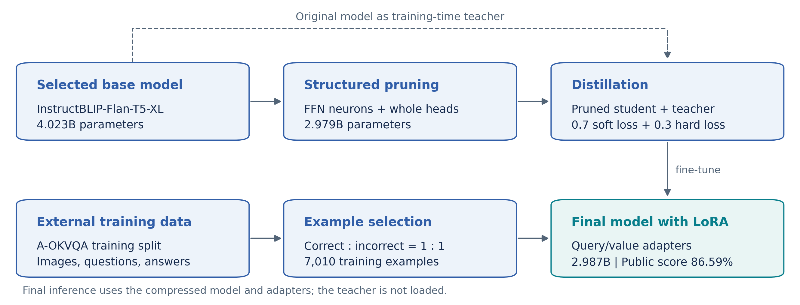
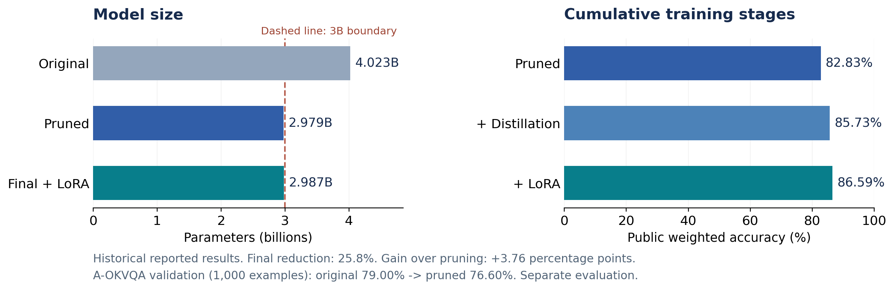

# Efficient Visual Question Answering under a 3B Parameter Budget

Yookyung Youn | Korea University

Technical report | SCPC 2025 AI Challenge, 1st Place | Documentation edition: September 2026

## Abstract

The SCPC 2025 AI Challenge required a multimodal model for multiple-choice visual question answering with fewer than three billion parameters used at inference. I independently designed and implemented a solution based on structural compression of InstructBLIP-Flan-T5-XL. The method combines activation-aware neuron-level structured pruning of decoder feed-forward networks (FFNs), similarity-guided head-level structured pruning of decoder attention, teacher-student knowledge distillation, and LoRA fine-tuning on a balanced mixture of previously correct and incorrect examples. The final model contains 2,986,746,208 parameters, approximately 25.8% fewer than the original model. Reported public leaderboard weighted accuracy increased from 82.83% after pruning to 85.73% after distillation and 86.59% after LoRA. This report describes the decisions and experimental evidence behind the solution, which received first place in the AI Challenge. The numerical results are reconstructed from my archived competition records; they have not been remeasured for this documentation release.

## 1. Problem and Individual Contribution

Each example consists of an image, a question, and candidate answers. The model must select the answer supported by the image and relevant knowledge. The competition's inference budget counted all model parameters loaded during inference and required their sum to remain below 3B. The rules also restricted eligible pretrained models and external data [1].

The task and constraints left the solution strategy open. I selected the base model and data, designed the compression and training procedure, implemented the experiments and final inference pipeline, and prepared the submission as an individual participant. The central design question was how to preserve useful visual question answering behavior while removing enough parameters to meet the budget.

The solution builds on existing models and methods [3-7]. My contribution is the task-specific combination, structural implementation, experimental selection of compression settings, and integration into the final competition system.

Figure 1. Structured pruning removes FFN intermediate neurons and whole decoder attention heads. The original model supplies the starting weights and the training-time teacher. Final inference uses the compressed student with LoRA adapters.

<!-- pagebreak -->

## 2. Model Selection and Structural Compression

### 2.1 Selecting the starting model

I compared candidate vision-language models using the task format and a 1,000-example A-OKVQA validation subset. The selected InstructBLIP-Flan-T5-XL model [3] achieved a reported 79.00% accuracy on that subset before compression. Its recorded parameter count was 4,022,969,088, which exceeded the competition budget.

The development record emphasizes instruction following and compatibility between pretrained components. Compressing a pretrained model preserved its existing component alignment. This choice reflects the available setting; the archived alternatives are insufficient for an exhaustive model comparison or a general claim against component replacement.

### 2.2 Neuron-level structured pruning of decoder FFNs

The decoder has 24 gated FFNs, each initially with intermediate width 5,120 and input/output width 2,048. For each intermediate neuron, the importance score multiplies its mean absolute gated activation by the L2 norm of the corresponding output-projection column. The archived code collects activations during generation on the first 250 A-OKVQA training examples. This neuron-group criterion is inspired by Wanda's weight/activation principle [5]; its aggregation and removal unit differ from Wanda's individual-weight criterion.

I globally ranked neurons across decoder layers and selected the lowest-scoring 95% for removal. Candidate experiments masked entire columns of `wo`. The final implementation physically removes the corresponding rows of both gated input projections (`wi_0`, `wi_1`) and columns of `wo`, rebuilding smaller dense layers. This is neuron-level structured pruning: intermediate widths shrink, while the input/output width remains 2,048. Retained widths vary by layer; 95% is the aggregate removal rate, not a fixed per-layer rate.

The recorded decoder FFN parameter count decreased from 754,974,720 to 37,748,736, a 95% reduction for that component, not for the whole model.

Separate hidden-state masking experiments used activation-norm analysis and clustering to assess sensitivity. A larger comparison used 2,000 A-OKVQA training examples. These were development diagnostics; they do not imply that hidden-state dimension pruning was part of the final architecture.

### 2.3 Head-level structured pruning of decoder attention

I analyzed attention-head similarity on 500 A-OKVQA training examples, used a greedy procedure to identify candidate removals, and evaluated approximately 60 removal configurations on a 100-example validation subset. Similarity provided a search heuristic; task performance determined which candidate configuration to retain.

The same zero-based head indices [1, 3, 4, 8, 10, 11, 12, 14, 17, 21, 24, 25, 26] were removed from decoder self-attention and cross-attention in all 24 layers. Each module retained 19 of 32 heads. The implementation removes the associated rows of the query/key/value projections and columns of the output projection, then updates head counts and internal dimensions. At 64 dimensions per head, internal width shrinks from 2,048 to 1,216 while input/output widths stay fixed. The recorded decoder attention count decreased from 805,306,368 to 478,150,656 parameters.

Together, the pruning stages produced a model with 2,978,586,976 parameters. On the reported 1,000-example A-OKVQA validation subset, accuracy decreased from 79.00% to 76.60%. The pruned model's separate public competition score was 82.83%.

Pruning reduces the whole-model parameter count by 25.96%; adding adapters yields a final reduction of 25.76%, rounded to 25.8% in overview text. Tables retain the exact archived counts.

<!-- pagebreak -->

## 3. Distillation and LoRA Fine-Tuning

### 3.1 Teacher-student stabilization

I used the original unpruned InstructBLIP model as the teacher and the compressed model as the student. The objective combined a soft-target distillation term with a hard-label term:

`L = 0.7 * L_distillation + 0.3 * L_hard`

The recorded distillation term used KL divergence with temperature scaling, while the hard-label term used cross-entropy. The purpose was to provide distributional supervision from the original model alongside the target answers, following the knowledge-distillation principle [6]. The archive summary does not establish the exact temperature or reduction convention, so these are not supplied as verified settings here.

| Recorded setting | Value |
|---|---|
| Teacher | Original InstructBLIP-Flan-T5-XL; evaluation mode, float16 |
| Student | Structurally pruned model |
| Training data | A-OKVQA train split; 17,056 examples |
| Epochs | 3 |
| Learning rate | 5e-6 |
| Gradient accumulation | 4 steps |
| Warmup | First 10% of training; linear warmup |
| Gradient clipping | Applied; numerical threshold not specified here |
| Checkpoint selection | Best recorded validation loss |

The reported public score increased to 85.73%, a gain of 2.90 percentage points over the pruned stage. Distillation retained the pruned architecture. The teacher supplied training supervision and was not included in the final inference model.

### 3.2 LoRA on the compressed architecture

I then applied LoRA [7] to query and value projections of the language model, with rank 16 and alpha 32. Because structural pruning changed module dimensions, adapter placement needed to match the compressed modules. The base weights were held fixed during adapter training, as described in the development record.

Training used 7,010 A-OKVQA training examples, balanced at a 1:1 ratio between examples the preceding model answered correctly and incorrectly. This mixture was intended to combine exposure to errors with examples of retained behavior. The experiment did not separately isolate the effect of balancing from the effect of LoRA training.

The adapters added 8,159,232 parameters. The final count was 2,986,746,208, leaving 13,253,792 parameters below the 3B boundary. Reported public weighted accuracy increased to 86.59%, a further gain of 0.86 percentage points. The overall gain after the initial pruning stage was 3.76 percentage points.

### 3.3 Reported compute

The archived record lists a 32GB RTX 5090 for analysis and inference, an 80GB A100 for distillation (approximately seven hours), and a 24GB RTX 3090 for LoRA training (approximately thirty minutes). These are historical resource descriptions. They are not controlled latency, memory, or throughput benchmarks.

<!-- pagebreak -->

## 4. Evaluation and Results

### 4.1 Distinguishing evaluation settings

Development experiments used subsets of A-OKVQA [4]. Their local accuracy measures must be distinguished from the competition's weighted accuracy. The official rules describe a public score based on a sampled portion of the final test data and a private score used in preliminary evaluation; the final event also evaluated the solution presentation [1]. The public scores below are not private scores or final judging scores.

| Experiment | Dataset and recorded size | Interpretation |
|---|---|---|
| Base/pruned comparison | A-OKVQA validation; 1,000 examples | Local task-performance comparison |
| FFN importance collection | A-OKVQA train; first 250 examples | Neuron-importance calibration |
| Larger masking comparison | A-OKVQA train; 2,000 examples | Sensitivity diagnostic |
| Head-similarity analysis | A-OKVQA train; 500 examples | Candidate-generation signal |
| Head-removal search | A-OKVQA validation; 100 examples | Approximately 60 configurations |
| Distillation | A-OKVQA train; 17,056 examples | Training data |
| LoRA mixture | A-OKVQA train; 7,010 examples | Balanced correct/incorrect examples |

These subsets served different purposes and can overlap; their sizes should not be added together as a count of unique examples. The validation subsets used during selection are development evidence, not an untouched held-out benchmark. Exact sample identifiers and repeated-seed statistics are not included in this release.

### 4.2 Stage-wise results

| Stage | Parameter count | A-OKVQA validation accuracy | Public weighted accuracy |
|---|---:|---:|---:|
| Original model | 4,022,969,088 | 79.00% | — |
| Structured pruning | 2,978,586,976 | 76.60% | 82.83% |
| Knowledge distillation | Same pruned architecture | — | 85.73% |
| Final model with LoRA | 2,986,746,208 | — | 86.59% |

The validation column uses 1,000 A-OKVQA examples: pruning decreases accuracy by 2.40 percentage points. A dash indicates that the consulted records supply no value for that metric and stage. Comparisons must remain within the same evaluation column.

Figure 2. Parameter counts and public leaderboard scores are plotted separately; the annotation also records the local A-OKVQA baseline comparison. Both plotted axes start at zero. The original model's 79.00% validation accuracy is not a public leaderboard score.

<!-- pagebreak -->

## 5. Interpretation, Limitations, and Release Scope

### 5.1 What the evidence supports

The solution demonstrates a complete competition workflow under a concrete parameter budget: choosing a pretrained model, allocating structural compression, investigating removal choices, training the compressed model, and producing the final submission. The archived stage-wise scores show that later training improved on the initial pruned result while the final model remained below the required size.

The design process also illustrates why different measurements were useful at different stages. Importance statistics and similarity analysis narrowed the search, small task evaluations selected candidates, and competition scores recorded the resulting system's performance. A high similarity value alone was not treated as proof that removal would preserve answers.

### 5.2 Limits of the comparisons

The results are sequential checkpoints of a single development process. They do not form a factorial ablation of pruning, distillation, LoRA, and example balancing. In particular, the last gain cannot be attributed solely to balancing or solely to the adapter mechanism.

The head-removal search evaluated many configurations on a small subset. Selection on that subset can overfit it. The A-OKVQA results should also not be presented as evidence that the base model had never encountered related data during pretraining. Neither the released aggregate tables nor the development record establish that claim.

This release contains no confidence intervals or repeated-seed estimates. It does not establish performance on other VQA datasets, distribution shifts, or safety-critical tasks. Parameter reduction alone does not establish lower latency, peak memory, or energy use; those require separate measurements.

### 5.3 Award and public materials

Samsung's official announcement identifies Yookyung Youn (listed as "Yoo Kyung Youn") of Korea University as the first-place winner of the 2025 AI Challenge [2]. That award is distinct from the 86.59% public score and should not be interpreted as a claim of first place on the public leaderboard alone.

This repository contains this report, newly drawn figures, and aggregate result tables. It does not distribute the competition presentation, implementation notebooks, model checkpoints, or raw datasets. The figures summarize the method and numerical records in a new visual format. This is a technical project report, not an executable reproduction release or a claim of peer-reviewed publication.

## References

1. DACON. [SCPC 2025 AI Challenge: official rules](https://www.dacon.io/en/competitions/official/236500/overview/rules). Competition constraints and evaluation procedure.
2. Samsung Research. [Samsung Electronics Unveils Winners of the 11th Samsung Collegiate Programming Challenge](https://research.samsung.com/news/Samsung-Electronics-Unveils-Winners-of-11th-Collegiate-Programming-Challenge-as-Part-of-AI-Talent-Discovery-Initiative). Official award announcement, 2025.
3. Dai et al. [InstructBLIP: Towards General-purpose Vision-Language Models with Instruction Tuning](https://arxiv.org/abs/2305.06500), 2023. [Selected model](https://huggingface.co/Salesforce/instructblip-flan-t5-xl).
4. Schwenk et al. [A-OKVQA: A Benchmark for Visual Question Answering using World Knowledge](https://arxiv.org/abs/2206.01718), 2022. [Dataset repository](https://github.com/allenai/aokvqa).
5. Sun et al. [A Simple and Effective Pruning Approach for Large Language Models](https://arxiv.org/abs/2306.11695), ICLR 2024.
6. Hinton, Vinyals, and Dean. [Distilling the Knowledge in a Neural Network](https://arxiv.org/abs/1503.02531), 2015.
7. Hu et al. [LoRA: Low-Rank Adaptation of Large Language Models](https://arxiv.org/abs/2106.09685), 2021.
